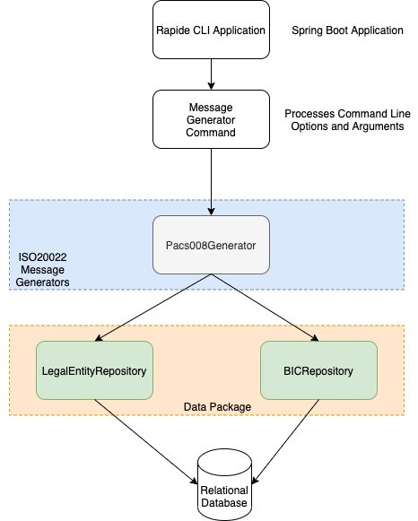

## rapide - An ISO 20022 Message Generator
This project is a simple ISO20022 message generator that generates pacs.008 xml messages for serial message flow. The 
project is called [rapide](https://dictionary.cambridge.org/dictionary/french-english/rapide), a French word. It translates to 
[swift or fast or quick](https://dictionary.cambridge.org/dictionary/english-french/swift) or swift, a swallow like bird. 

The Java package names start with rapide at the root. You will notice references to rapide in different places such as 
name of the wrapper bash shell script for the CLI tool.

## Table of Contents

  1. [Features](#features)
  1. [Getting Started](#getting-started)
  1. [Usage](#usage)
  1. [Architecture](#architecture)

     * [Databases](#databases)

  1. [Configuring the Message Generator](#configuring-the-message-generator)
     * [Increasing log level](#increasing-log-level)
     * [Using a Relational Database Server](#using-a-relational-database-server)
     * [Category and Payment Purpose Codes](#category-and-payment-purpose-codes)
     * [Currency Codes](#currency-codes)
     * [Source and Destination BICs](#source-and-destination-bics)
    
  1. [License](#license)

## Features
The ISO 20022 message generator supports generation of pacs.008 xml messages for serial message flow. It can generate a 
configurable number of messages with randomization of message elements as below:
- Charge Bearer: Randomly rotate value of <ChrgBr> between "SHAR", "DEBT" or "CRED". If "CRED" is used then <ChrgsInf> block is added 
  with <Amt> set to a random value ranging from "1.00" to "15.00" with 2 decimal places.
- Category Codes and Payment Purpose Code: Randomly rotate value of <Cd> using the "Code" list in a configuration file.
- Post Address: Randomly rotate the details of the Debtor, Ultimate Debtor and Creditor and Ultimate Creditor parties, 
  using the LEI database and randomly populates the <PstlAdr>. LEI database has to be provided by the user.
- BIC Addresses, Instructing and Instructed Agents: Randomly rotate the details of the <InstgAgt> and <InstdAgt>, 
  using the "BIC CODE" in the BIC database. BIC database has to be provided by the user. See [Databases](#databases) 
  section for details.
- BIC Addresses, Previous Instructing Agent1, Intermediary Agent1: Randomly rotate the details of the <PrvsInstAgt1> 
  and <IntrmyAgt1> using the "BIC CODE" in the BIC database. BIC database has to be provided by the user. See 
  [Databases](#databases) section for details.
- Currency Code: Randomly rotate the Currency Code in <Ccy> with 3 character currency codes using the ISO 4217. 
- Instructed and Instructing Agents: Users can control the use of BIC codes for instructing and instructed agents by 
  providing a list of BIC code in a configuration file. Only BIC Codes from configuration file are used, BIC database is
  ignored.

## Getting Started
### Prerequsities
The rapide software is built using Java. You will need JDK 11 or higher to be installed on your developer machine. You 
can use [Amazon Corretto](https://aws.amazon.com/corretto/), an openJDK distribution from Amazon.

### Build the Message Generator 
1. Clone this repository:
   ```bash
   git clone https://github.com/aws-samples/iso20022-message-generator.git
   ```

1. Change directory to the clone repository:
   ```bash
   cd iso20022-message-generator
   ```
   
1. Build the message generator:
   ```bash
   ./gradlew clean build
   ```

   This will build the Spring Boot jar.  
  
1. Run the iso20022 message generator cli:
   ```bash
   cd pacs008
   ./rapide-iso20022 # this print the command line options
   ```
   

## Usage
rapide, an ISO 20022 message generator, is command line tool and provides options to control:  
- number of sample messages to generate
- customize name of the generated xml message file
- directory where to place all generated xml message files
- zip all generated xml message files

```bash 
Usage: rapide-iso20022 [-z] [-d=<outputDirectory>] -n=<numberOfMessages> [-o=<outputFilePrefix>]
    -d, --directory=<outputDirectory>
          Directory where files will be written to
    -n, --number-of-messages=<numberOfMessages>
          Number of messages to generate
    -o, --output-file-prefix=<outputFilePrefix>
          File name prefix that will store generated messages
    -z, --archive   Flag to create zip file of generated files
```
  
Only `-n or --number-of-messages` is required option and if `-d or --directory` is not used then files are generated in 
current working directory.

## Architecture
Rapide software is built using Java and it uses following open source Java libraries, frameworks and platforms:
- [Spring Boot](https://spring.io/projects/spring-boot)
- [Gradle Build Tool](https://gradle.org/)
- [Hibernate ORM](https://hibernate.org/orm/)
- [Project Lombok](https://projectlombok.org/)  
- [Prowide iso20022 library](https://github.com/prowide/prowide-iso20022)

The diagram below shows high level architecture diagram of the Rapide CLI tool.



### Databases
There are two databases used by the message generator:  
- LEI Database: The data for LEI can be obtained from [Global Legal Entity Foundation or GLEIF](
  https://www.gleif.org/en/lei-data/access-and-use-lei-data) website. The JPA Entity model mentioned below was created 
  [data file](https://www.gleif.org/en/lei-data/gleif-golden-copy/download-the-golden-copy#/) available on GLEIF web site. 
  A sample file with dummy data is [here](pacs008/src/main/resources/db/lei_sample_records.csv).
- BIC Database: The BIC database can be obtained from SWIFT. The JPA Entity model mentioned below was created a sample 
  data file. A sample file with dummy data is [here](pacs008/src/main/resources/db/bic_sample_records.csv).
  
We recommended that you obtain the LEI and BIC data from these data providers. The data files in CSV format should be 
consistent with the sample files mentioned above. If they diverge, you can fork this repository and modify the JPA 
entities below to meet your needs.
  
The `rapide.iso20022.data` package has Spring Data Repository and JPA Entities for each database. 
- [LegalEntity](pacs008/src/main/java/rapide/iso20022/data/lei/model/LegalEntity.java) - see this class for LegalEntity attributes
- [BICRecord](pacs008/src/main/java/rapide/iso20022/data/bic/model/BICRecord.java) - see this class for BIC attributes
- [Database Schema](pacs008/src/main/resources/schema.sql) has DDL for above entities as well code for loading H2 in-memory 
  database with records from a CSV files. 
  
## Configuring the Message Generator
The ISO 20022 message generator CLI tool provides various options to customize message generation. As mentioned the message generator 
tool built using Spring Boot and hence the customizations are done using Spring Boot's `application.yaml` file. 
These options can be provided using [Spring Boot's mechanisms for providing application yaml](
https://docs.spring.io/spring-boot/docs/current/reference/html/features.html#features.external-config), see section 2.3:

1. Modifying the [application.yaml](pacs008/src/main/resources/application.yml) file and rebuilding the jar.
1. Providing an updated `application.yaml` in current directory (i.e. pacs008) or config directory in pacs008d directory. 
   Spring Boot will automatically read `application.yaml` placed above directory.

The `application.yaml` file contains configurable properties for both Spring Boot related resources and rapide CLI tool. 
The Spring related configuration properties are under Spring's namespace and hierarchy.

The rapide's message generator's configurable properties are under `rapide` hierarchy:
```yaml
rapide:
  PurposeCode:
  Currency:
  SourceBicList:
  DestinationBicList:
  ...
```

### Increasing log level
Logging is performed using Spring Boot's [Logging](https://docs.spring.io/spring-boot/docs/current/reference/html/features.html#features.logging) 
support. The [application.yaml](pacs008/src/main/resources/application.yml) file controls log levels. By default it the 
log level is at `ERROR` level. You can change the log level to `info` or `debug` to get detailed logs for troubleshooting.

### Using a Relational Database Server
You can replace in-memory H2 relational database with any relational database such as Amazon RDS (any support relational 
database e.g. mysql, postgresql et.c). This is possible due to Spring Boot's [Spring Data JPA](
https://docs.spring.io/spring-boot/docs/current/reference/html/features.html#features.sql.jpa-and-spring-data) support.

The data source related properties in `application.yaml` can be configured to meet the needs of your database platform. 
See Spring Boot's documentation on [Data Access](
https://docs.spring.io/spring-boot/docs/current/reference/html/howto.html#howto.data-access). For example to use Amazon RDS 
for MySQL, the application.yaml file will look like one shown below:
```yaml
spring:
  datasource:
    platform: mysql
    driver-class-name: com.mysql.cj.jdbc.Driver
    url: jdbc:mysql://{instance-id}.{random-identifier}.{region}.rds.amazonaws.com:3306/{database-name}
    username: <username>
    password: <password>
  jpa:
    database-platform: org.hibernate.dialect.MySQLDialect
```

You can also initialize database with reference data or full records on startup using Hibernate's database initialization mechanism in 
conjunction with Spring Boot as documented [here](
https://docs.spring.io/spring-boot/docs/current/reference/html/howto.html#howto.data-initialization).

### Category and Payment Purpose Codes
The category codes and payment purpose codes used in the generated messages can be customized by providing them in `application.yaml` 
under property `rapide.PurposeCode`:  
```yaml
rapide:
  PurposeCode:
    - Your code 1
    - Your code 2
    - ... 
```

### Currency Codes
You can provide currency for countries by adding them in the `application.yaml` under `rapide.Currency` property:  
```yaml
   rapide:
   Currency:
      - Country: US
        Code: USD
      - Country: UK
        Code: GBP
```

### Source and Destination BICs
You can add a list of source and destination BICs to be used in generated messages by adding them in the `application.yaml` 
under `rapide.SourceBicList` property for source BIC list (from BIC) and `rapide.DestinationBicList` property for 
destination BIC list:
```yaml
   rapide:
      SourceBicList:
         - Your Source BIC1
         - Your Source BIC2
      DestinationBicList:
         - Your Destination BIC1
         - Your Destination BIC2
```   

In this case the BIC codes in BIC database are ignored (i.e. are not selected randomly from BIC database). You can choose to 
just override source BIC or destination BIC only or both.

## License

This source code is licensed under the [MIT-0 License](https://github.com/aws/mit-0). See the [LICENSE](LICENSE) file for details.

