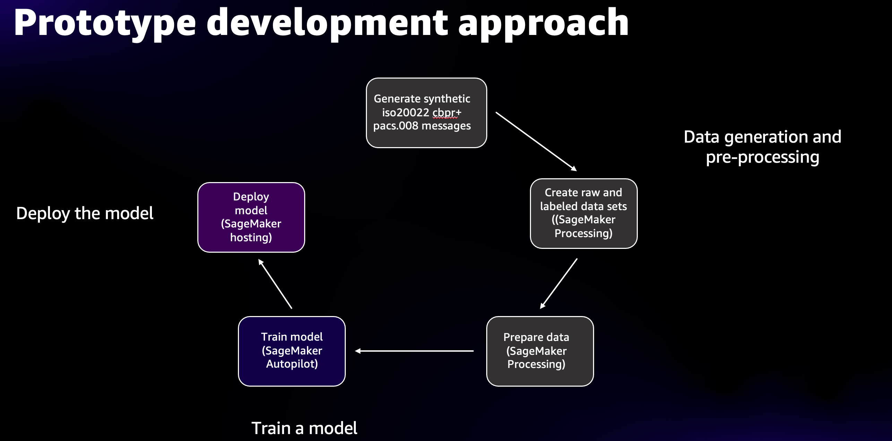

# ML Prototypes - ML Models for ISO20022 PACS008 Message Processing Prediction

This directory contains machine learning model prototypes for predicting if an ISO20022 pacs.008 XML message will be
Amazon SageMaker Machine Learning project for creating a machine learning model that predicts whether an ISO20022 pacs.008 
XML message will be successfully processed (`Success`) or fail processing (`Failure`) leading to exception processing. 
The prototype models' prediction is in form of a tuple [(1=Success, 0=Failure), Probability Score] where probability score is probability of the predicted 
outcome.

## Directory Breakdown
The project consists of Python notebooks in following directories:
1. [pacs008/synthetic-data](pacs008/synthetic-data): This directory contains two notebooks for generating synthetic data for the ML prototype. 
   * iso20022_lei_bic_datasets.ipynb: This notebook generates fake BIC database as a csv file and LEI database again as a
     csv file. Read the notebook for details. There two generated csv files that can be used for ML prototype. These csv 
     files were used in pacs.008 XML message generation by the iso20022 message generator tool by this prototype.
   * gen_pacs008_synthetic_dataset.ipynb: This notebook creates synthetic raw and labeled dataset using ISO20022 pacs.008 
     XML messages generated by [ISO20022 Message Generator tool]( ../../iso20022-message-generator).
2. [pacs008/automl](pacs008/automl): This directory contains notebooks that use Amazon SageMaker Autopilot service to train ML models:
   * pacs008_automl_model_training.ipynb: Prototype model using Amazon SageMaker Autopilot service. It uses labeled 
     synthetic data generated by [gen_pacs008_synthetic_dataset.ipynb](pacs008/synthetic-data/gen_pacs008_synthetic_dataset.ipynb) 
     to train several models by SageMaker Autopilot and then selecting the best performing model for deployment.
   * pacs008_automl_model_deployment.ipynb: This notebook deploys the best performing ML model from ML SageMaker Autopilot 
     training job.
   * automl_batch_transform_example.ipynb: Demonstrates batch inference using Amazon SageMaker Batch Transform service.
3. [pacs008/xgboost](pacs008/xgboost): This directory contains notebooks that use Amazon SageMaker XGBoost built-in algorithm to train an ML model.
   * pacs008_xgboost_inference_pipeline.ipynb: A notebook that trains an ML model using Amazon SageMaker XGBoost built-in algorithm.
     After training the model is deployed to an Amazon SageMaker Inference Endpoint. It uses Amazon SageMaker Inference Pipeline 
     to deploy scikit-learn container for data transformation and XGBoost model for inference.
   * pacs008_xgboost_local.ipynb: This notebooks demonstrates data analysis and feature engineering of a text feature 
     (`InstrForNxtAgt`). The text feature is transformed into numeric representation using text preprocessing techniques 
     such as word frequency count, term frequency-inverse document frequency (TFIDF) and Multinomial Naive Bayes model to 
     understand how text can help in predictions. The approach was used to write custom scikit-learn transformers to transform
     text to numeric features (feature engineering).
   * xgb_batch_transform_example.ipynb: A notebook that demonstrates use of Amazon SageMaker Batch Transform for batch inference 
     using XGBoost model.
4. [pacs008/linear-learner](pacs008/linear-learner): This directory contains notebooks that use Amazon SageMaker Linear Learner built-in algorithm to train ML models.
   * pacs008_linear_learner_inference_pipeline.ipynb: A notebook that trains an ML model using Amazon SageMaker Linear Learner built-in algorithm.
     After training the model is deployed to an Amazon SageMaker Inference Endpoint. It uses Amazon SageMaker Inference Pipeline 
     to deploy scikit-learn container for data transformation and Linear Learner model for inference.
   * ll_batch_transform_example.ipynb: A notebook that demonstrates use of Amazon SageMaker Batch Transform for batch inference 
     using a Linear Learner model.
5. [pacs008/sklearn-transformers](pacs008/sklearn-transformers): This directory contains custom scikit-learn transformers that are used in data preprocessing and 
   feature engineering tasks. These transformers are deployed in scikit-learn containers in SageMaker Inference Pipeline
   that is used to deploy XGBoost and Linear Learner trained models.
   * pacs008_sklearn_featurizer.py: Implements data preprocessing and featurizing features using scikit-learn pipeline and 
     ColumnTransformer. This transforms and prepares data before training jobs and before using features in pacs.008 XML 
     message for inference, either using realtime inference via Inference Endpoint or batch inference via Batch Transform.
   * pacs008_sklearn_transformer.py: Implements scikit-learn custom transformers.

These notebooks should be run using a Python3 Jupyter notebook kernel.  This can be `Python 3 (Data Science)` kernel in 
SageMaker Studio or `conda_python3` kernel in SageMaker notebook instance.

## Machine Learning Prototype development approach
The diagram below captures the ML lifecycle used to develop the ML prototype:



To get started with the ML prototype model, follow the steps below:   

**Note**: The githib repository includes [iso20022-raw-messages.tar.gz](pacs008/synthetic-data/iso20022-data/iso20022-raw-messages.tar.gz) 
to get you stated quickly. If you want to use that set raw ISO20022 pacs.008 XML messages, you can skip steps 1 and 2.   
  
1. Generate ISO20022 pacs.008 XML messages using the [ISO20022 Message Generator tool](../../iso20022-message-generator).
   ```bash
   rapide-iso20022 -n 50000 -d messages
   ```
   
2. Gzip the messages directory upload to Amazon SageMaker notebook (either Amazon SageMaker Studio notebook or Amazon 
   SageMaker Notebook instance) in the `iso20022-message-generator/ml-models/pacs008/synthetic-data/iso20022-data` directory 
   i.e. directory where you cloned this github repository. 

3. You can use Amazon SageMaker Autopilot or Amazon Sagemaker XGBoost or Amazon SageMaker Linear Learner or all notebooks 
   to train and deploy an ML model. After deployment, you can test it by sending a test message to the Inference Endpoint. 
   Training all models will allow you to compare and evaluate model performance using each of the approaches.

5. You can also use SageMaker Batch Transform notebook to perform batch inference using the training model and 
   evaluate model's performance.

